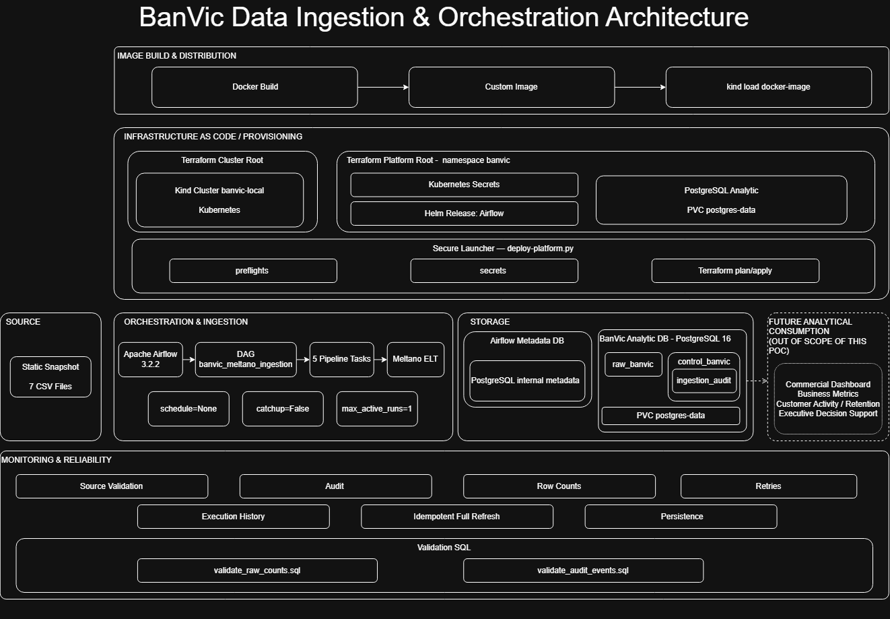

# Certificação Data Engineer — BanVic

Este repositório contém a solução desenvolvida para o desafio **Certificação Data Engineer by Indicium**, com foco na construção de uma prova de conceito reprodutível de infraestrutura e ingestão de dados para o Banco Vitória S.A. (BanVic).

## Contexto e objetivo

O BanVic utiliza dados de clientes, contas, transações, agências, colaboradores e propostas de crédito em seus processos de negócio. A POC demonstra uma fundação técnica para centralizar esse conjunto de dados de forma reproduzível, validada e auditável.

A solução utiliza **Terraform** para provisionamento declarativo, Kubernetes com **Kind** para execução local, **Apache Airflow 3.2.2** para orquestração, **Meltano 4.2.0** para ELT e **PostgreSQL 16** como destino analítico.

O objetivo técnico é disponibilizar uma infraestrutura local, segura e reproduzível capaz de ingerir e centralizar as sete tabelas fornecidas no desafio BanVic, contemplando:

- provisionamento declarativo da infraestrutura com Terraform;
- execução conteinerizada do Airflow em Kubernetes;
- ingestão ELT com Meltano, `tap-csv` e `target-postgres`;
- armazenamento centralizado em PostgreSQL;
- validações da fonte antes da alteração do destino;
- validações das tabelas após a carga;
- auditoria operacional por execução, task e tabela;
- retries e tratamento explícito de falhas;
- idempotência por full refresh controlado;
- persistência dos dados analíticos;
- gerenciamento seguro de credenciais;
- scripts SQL para validação da carga e da auditoria.

Do ponto de vista do negócio, a POC cria uma fundação centralizada, validada e rastreável sobre clientes, contas, transações, agências e crédito, permitindo que posteriormente a área Comercial e a Diretoria construam indicadores e análises confiáveis para apoiar retenção, atividade dos clientes e tomada de decisão.

## Arquitetura



A arquitetura separa provisionamento, orquestração, ingestão e armazenamento em responsabilidades independentes:

| Componente | Papel |
|---|---|
| Terraform | Provisiona declarativamente o cluster Kind e os recursos da plataforma |
| Docker | Constrói a imagem customizada do Airflow com Meltano e seus plugins |
| Kind / Kubernetes | Executa e orquestra localmente os componentes da solução |
| Apache Airflow | Orquestra o pipeline, retries, validações e auditoria |
| Meltano | Executa a extração dos CSVs e a carga no PostgreSQL |
| PostgreSQL do Airflow | Mantém os metadados internos do Airflow |
| PostgreSQL BanVic | Armazena `raw_banvic` e `control_banvic` |
| Kubernetes Secrets | Mantêm credenciais e chaves fora do código versionado |

A infraestrutura Terraform é dividida em dois roots independentes:

- `infra/terraform/cluster`: provisiona o cluster Kind `banvic-local`;
- `infra/terraform/platform`: provisiona namespace, Secrets, PostgreSQL analítico e Airflow via Helm.

O banco analítico utiliza o PVC `postgres-data`, permitindo que os dados sobrevivam à substituição do Pod PostgreSQL.

A descrição detalhada das decisões arquiteturais, trade-offs e limitações está em [docs/ARCHITECTURE.md](docs/ARCHITECTURE.md).

## Estratégia de ingestão e orquestração

A fonte da POC é um snapshot composto por sete arquivos CSV armazenados em `data/input/banvic_raw/`. Durante o build, esses arquivos são incorporados à imagem utilizada pelo Airflow.

O Meltano executa a ingestão com `tap-csv` para extração e `target-postgres` para carga no schema `raw_banvic`.

A estratégia implementada é um **full refresh idempotente**. Antes de alterar o destino, a DAG valida os arquivos de origem; somente depois dessa validação o schema RAW é recriado e carregado novamente. Dessa forma, execuções sucessivas produzem o mesmo estado final sem acumular registros duplicados.

A DAG `banvic_meltano_ingestion` executa cinco etapas sequenciais:

1. `ensure_audit_table`
2. `validate_source_files`
3. `recreate_raw_schema`
4. `run_meltano_tap_csv_to_target_postgres`
5. `validate_loaded_tables`

Configuração operacional da POC:

- `schedule=None`
- `catchup=False`
- `max_active_runs=1`

A execução é intencionalmente sob demanda, pois o desafio utiliza um snapshot estático. Em produção, a cadência deve ser definida a partir do SLA do processo, da frequência de disponibilização da fonte e das necessidades dos consumidores.

Os eventos operacionais são persistidos em `control_banvic.ingestion_audit`, permitindo rastrear execução, task, tabela, status, contagem de registros e mensagens de validação.

## Quick Start

Pré-requisitos: Docker, Kind, `kubectl`, Terraform `1.16.x`, Python 3 e Git.

### 1. Construir a imagem

```bash
docker build --no-cache --pull --tag banvic-airflow-meltano:0.6.4 --file infra/airflow/Dockerfile .
```

### 2. Provisionar o cluster Kind

```bash
terraform -chdir=infra/terraform/cluster init
terraform -chdir=infra/terraform/cluster plan
terraform -chdir=infra/terraform/cluster apply
```

### 3. Carregar a imagem no cluster

```bash
kind load docker-image banvic-airflow-meltano:0.6.4 --name banvic-local
```

### 4. Provisionar a plataforma

```bash
terraform -chdir=infra/terraform/platform init
python3 scripts/deploy-platform.py plan
python3 scripts/deploy-platform.py apply
```

### 5. Validar a plataforma

```bash
kubectl --kubeconfig ~/.kube/banvic-local-config --context kind-banvic-local --namespace banvic get pods,pvc,jobs
```

### 6. Executar a DAG

1. Defina o scheduler: `SCHEDULER_POD=$(kubectl --kubeconfig ~/.kube/banvic-local-config --context kind-banvic-local --namespace banvic get pods -l component=scheduler -o jsonpath={.items[0].metadata.name})`
2. Dispare a DAG: `kubectl --kubeconfig ~/.kube/banvic-local-config --context kind-banvic-local --namespace banvic exec -c scheduler "$SCHEDULER_POD" -- airflow dags trigger banvic_meltano_ingestion`
3. Consulte as execuções: `kubectl --kubeconfig ~/.kube/banvic-local-config --context kind-banvic-local --namespace banvic exec -c scheduler "$SCHEDULER_POD" -- airflow dags list-runs banvic_meltano_ingestion`

O resultado esperado para a execução mais recente é `state = success`.

### 7. Validar a carga

Após a execução, valide as contagens das tabelas e os eventos de auditoria com os scripts SQL versionados em `sql/`.

O procedimento operacional completo está em [docs/RUNBOOK.md](docs/RUNBOOK.md) e as evidências de validação estão em [docs/VALIDATION.md](docs/VALIDATION.md).

## Validação e evidências

A solução foi validada a partir de um clone limpo do repositório.

O gate técnico confirmou:

- provisionamento do cluster e da plataforma a partir do código versionado;
- DAG `banvic_meltano_ingestion` disponível e sem erros de importação;
- duas execuções consecutivas concluídas com sucesso;
- mesmas contagens nas sete entidades após ambas as execuções;
- 18 eventos de auditoria registrados por execução bem-sucedida;
- ausência de multiplicação de registros entre execuções;
- persistência dos dados e da auditoria após substituição do Pod do PostgreSQL analítico;
- `terraform plan` sem mudanças nos roots de cluster e plataforma após o provisionamento.

Os resultados, contagens e comandos de verificação estão documentados em [docs/VALIDATION.md](docs/VALIDATION.md).

## Segurança

Nenhuma senha, token, chave ou string de conexão operacional deve ser versionada no Git.

A solução utiliza Kubernetes Secrets provisionados pelo Terraform e um launcher seguro (`scripts/deploy-platform.py`) para conduzir o bootstrap e o plan/apply sem exibir valores sensíveis no terminal.

As variáveis Terraform que carregam segredos são marcadas como `sensitive` e `ephemeral`, e os Secrets utilizam atributos write-only para evitar a persistência dos valores sensíveis no state.

Os detalhes do modelo de segurança e das decisões de segregação de credenciais estão em [docs/ARCHITECTURE.md](docs/ARCHITECTURE.md).

## Limitações e evolução

Esta solução é uma POC local. Portanto, não implementa carga incremental ou CDC, alta disponibilidade, secret manager externo, observabilidade centralizada, logs persistentes ou backend remoto para o state do Terraform.

Os dados fonte são incorporados à imagem durante o build e o PVC `local-path` preserva dados durante a recriação do Pod, mas não após a exclusão completa do cluster Kind.

Uma evolução para produção deveria considerar object storage ou fonte externa, estratégia incremental, CI/CD, backend remoto do Terraform com locking, secret manager, observabilidade centralizada, backup, políticas de rede e uma camada analítica própria para consumo.

O escopo atual não inclui dbt, modelo dimensional, dashboard ou KPIs de negócio. Esses componentes são evoluções futuras sobre a fundação de ingestão, governança operacional e rastreabilidade construída nesta POC.

## Documentação técnica

- [Arquitetura e decisões técnicas](docs/ARCHITECTURE.md): componentes, ingestão, orquestração, persistência, segurança, trade-offs e limitações.
- [Runbook operacional](docs/RUNBOOK.md): procedimento completo para build, provisionamento, validação do ambiente, execução da DAG e acesso ao Airflow.
- [Validação técnica](docs/VALIDATION.md): comandos, contagens e evidências obtidas durante a validação a partir de um clone limpo.

## Estrutura do repositório

```text
.
├── dags/                    # DAG de ingestão BanVic
├── data/input/banvic_raw/   # Snapshot dos sete CSVs
├── docs/
│   ├── ARCHITECTURE.md      # Arquitetura e decisões técnicas
│   ├── RUNBOOK.md           # Procedimento operacional completo
│   ├── VALIDATION.md        # Evidências e validações técnicas
│   ├── images/
│   └── videos/
├── infra/
│   ├── airflow/             # Dockerfile da imagem customizada
│   ├── k8s/                 # Valores Helm e artefatos legados/de apoio
│   └── terraform/
│       ├── cluster/         # Root Terraform do Kind
│       └── platform/        # Root Terraform da plataforma
├── meltano_project/         # Configuração e lockfiles do Meltano
├── scripts/                 # Launcher seguro de provisionamento
├── sql/                     # Consultas de validação
└── README.md
```

## Conclusão

A solução entrega uma POC funcional, reprodutível e auditável de engenharia de dados para o BanVic, cobrindo infraestrutura como código, Kubernetes, orquestração, ingestão, persistência, segurança, validação e rastreabilidade operacional.

O gate técnico executado a partir de um clone limpo demonstrou que o ambiente pode ser provisionado a partir do código versionado, que execuções consecutivas preservam o estado esperado dos dados e que a persistência do banco analítico resiste à substituição do Pod.

O escopo atual não pretende representar uma plataforma analítica de produção, mas sim uma fundação técnica confiável e extensível para futuras evoluções de dados e consumo analítico no BanVic.
